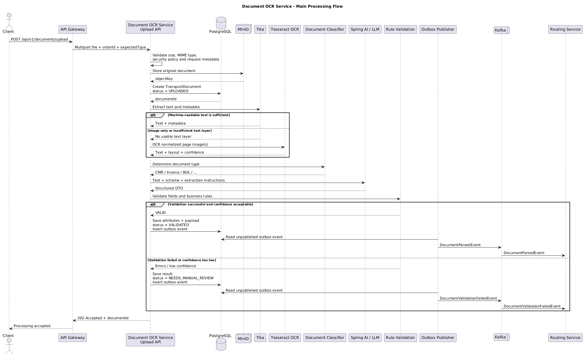

# Document OCR Service

## Overview

`document-ocr-service` is a backend service responsible for converting logistics documents from unstructured files into
validated, structured domain data.

The service accepts transport documents such as CMRs, Bills of Lading, customs declarations, invoices, specifications,
and scanned images. It extracts textual and positional information, converts it into document-specific DTOs, validates
the extracted data against business rules, stores the processing result, and published domain events for downstream
services.

The service belongs to the Strategic Routing & AI Intelligence domain and acts as the document intelligence layer
between uploaded logistics documents and services that require reliable structured data.

---

## Main Responsibilities

The service is responsible for

* accepting PDF, PNG, JPEG, and TIFF files up to 50 MB;
* securely storing original files in S3-compatible object storage;
* detecting whether a document already contains a machine-readable text layer;
* performing OCR for scanned or image-based documents;
* preserving page and bounding-box information where possible;
* identifying the document type;
* extracting domain attributes into strict Java Records;
* validating critical business attributes;
* routing uncertain or invalid documents to manual review;
* persisting document metadata, attributes, validation result, and processing state;
* publishing processing results through Kafka using the Outbox pattern;
* providing controlled access to document files through short-lived presigned URLs.

---

## Technology Stack

| Component       | Technology              | Role                                                                                |
|-----------------|-------------------------|-------------------------------------------------------------------------------------|
| Runtime         | Java                    | Application runtime; Virtual Threads are suitable for high-concurrency blocking I/O |
| Framework       | Spring Boot             | REST API, Dependency Injection, Persistence, Messaging, Observability               |
| AI Integration  | Spring AI               | Abstraction layer for communication with LLM providers                              |
| Text Extraction | Apache Tika             | Extracts existing text and metadata from supported document formats                 |
| OCR             | Tesseract OCR           | Converts text visible in raster images into machine-readable text                   |
| Object Storage  | MinIO                   | S3-compatible storage for original documents and derived artifacts                  |
| Database        | PostgreSQL              | Stores document state, attributes, rules, JSON payloads, and outbox events          |
| Messaging       | Apache Kafka            | Publishes document processing events to downstream services                         |
| Cache           | Redis                   | Rate limiting, temporary caching, and distributed coordination                      |
| Resilience      | Resilience4j            | Timeouts, retries, circuit breakers, and bulkheads around external dependencies     |
| Metrics         | Micrometer + Prometheus | Service and pipeline-level telemetry                                                |

---

## Application Architecture

The application uses a layered Spring MVC architecture. The primary request flow is:

```text
HTTP request
    ↓
rest.api → rest.controller → service → repository → entity
             ↓              ↓
          rest.dto       exception
             ↓              ↓
       HTTP response    rest.exception → ProblemDetail
```

The Java package structure under the service root is:

```text
config
entity
repository
service
exception
rest
├── api
├── controller
├── dto
└── exception
```

| Package             | Responsibility                                                                                  |
|---------------------|-------------------------------------------------------------------------------------------------|
| `config`            | Spring wiring, typed properties, external clients, bounded executors, and startup validation   |
| `entity`            | Persistence entities, domain state, value types, invariants, and legal state transitions        |
| `repository`        | Persistence access and bounded queries over entities                                             |
| `service`           | Use cases, business decisions, pipeline and integration orchestration, and transaction boundaries |
| `exception`         | Application and domain failures independent of HTTP and other transports                        |
| `rest`              | Namespace for the HTTP adapter; concrete types belong in its subpackages                         |
| `rest.api`          | API interfaces generated from, or validated against, the OpenAPI contract                       |
| `rest.controller`   | Thin Spring MVC controllers that implement `rest.api` and delegate to services                  |
| `rest.dto`          | OpenAPI-aligned REST request and response models, separate from persistence entities             |
| `rest.exception`    | HTTP exception mapping and RFC 9457 `ProblemDetail` responses                                    |

In MVC terms, `entity`, `repository`, and `service` make up the Model; `rest.controller` is the Controller; and
`rest.dto` is the external representation used instead of a server-rendered View. The `rest.api` contract is implemented
by the controllers, while `config`, `exception`, and `rest.exception` support the application without bypassing these
boundaries.

Controllers validate and map transport data but do not make business decisions. Services coordinate use cases and own
transaction boundaries. Repositories only implement persistence concerns. Entities must not depend on REST DTOs,
controllers, Kafka, object storage, or AI-provider SDK types, and persistence entities are never exposed directly in
an external contract.

---

## Core Concepts

### Apache Tika

Apache Tika extracts content that already exists inside a file.

For example, a digitally generated PDF may visually contain:

```text
Gross weight: 16 500 kg
Sender: ACME GmbH
```

and also contain the same text internally as a searchable PDF text layer.

Tika can extract that text without running OCR.

Conceptually:

```text
PDF / Office Document
        ↓
       Tika
        ↓
Existing text + Metadata
```

Tika should therefore be attempted before expensive OCR processing whenever the file format allows it.

---

### Tesseract OCR

Tesseract is an Optical Character Recognition engine.

It is required when the input contains only as pixels, for example:

* scanned paper documents;
* smartphone photos;
* image-only PDFs;
* rasterised document pages.

Conceptually:

```text
Image pixels
     ↓
 Tesseract
     ↓
Recognized text
```

Tesseract answers the question:

> "Which characters and words are visible in this image?"

It does **not** understand the logistics meaning of those values.

For example, OCR may recognise:

```text
16 500 kg
```

but it does not necessarily know whether the value represents gross weight, net weight, vehicle capacity, or another
field.

OCR processing is mostly **CPU**-intensive and must therefore use bounded concurrency. Creating more Virtual Threads
does not increase available CPU capacity.

---

### LLM Structured Extraction

After that extraction, an LLM is used to map unstructured document text into domain-specific fields.

Example input:

```text
Sender: ACME GmbH
Consignee: Logistics Trade
Gross weight: 16 500 kg
```

Example structured result:

```json
{
  "sender": "ACME GmbH",
  "cosignee": "Logistics Trade",
  "grossWeightKg": 16500
}
```

Spring AI provides the Java integration layer and can enforce a required response structure using schema-based
structured outputs.

A valid JSON structure does **not** guarantee that the extracted values are factually correct. Business validation, OCR
confidence, source references, and manual review remain necessary.

---

### Spring AI

Spring AI is the application-side abstraction used to communicate with an LLM.

It is not an AI model itself.

Depending on deployment requirements, the implementation may communicate with:

* OpenAI;
* Anthropic Claude;
* Ollama;
* vLLM;
* another compatible model provider.

The application should isolate provider-specific behaviour in dedicated configuration and service components so that
business logic does not depend directly on one vendor.

---

### Ollama and vLLM

Both can be used to serve locally hosted language models.

**Ollama** is convenient for local development and relatively simple model deployment.

**vLLM** is designed for efficient model serving and is generally more appropriate when high-throughput GPU inference,
batching, and production-grade model serving are required.

Local deployment may be preferred when logistics documents contain commercially sensitive or personally identifiable
information that must not leave the organisation's infrastructure.

---

### MinIO

MinIO is S3-compatible object storage.

It stores binary or large document artefacts such as:

* original PDFs;
* uploaded images;
* normalised page images;
* OCR-derived artefacts;
* optional structured OCR layout files.

PostgreSQL should store references to these objects rather than large document binaries.

Example:

```text
MinIO:
transport-documents/order-123/document-456/original.pdf

PostgreSQL:
document_id = 456
order_id = 123
object_key = order-123/document-456/original.pdf
status = PARSED
```

Direct public access to objects is prohibited. Clients receive short-lived presigned URLs when document access is
required.

---

### PostgreSQL

PostgreSQL is the source of truth for document processing state and business metadata.

Typical persisted information includes:

* document ID;
* order ID;
* original filename;
* object storage key;
* detected document type;
* processing status;
* extraction confidence;
* extracted attributes;
* validation errors;
* structured JSON payload;
* version information;
* outbox events.

The structured extraction payload may additionally be stored in `JSONB` for flexible querying and indexing.

---

### Kafka

Kafka is the asynchronous integration layer used to notify other services when document processing state changes.

Typical events include:

* `DocumentParsedEvent`
* `DocumentValidationFailedEvent`

A downstream service should not need to synchronously call the OCR service merely to discover that processing has
completed.

Kafka events should contain the business data required by consumers, but large OCR payloads or binary document content
should remain in PostgreSQL or object storage.

---

### Redis

Redis is intended for short-lived coordination rather than primary business persistence.

Typical use cases include:

* LLM rate limiting;
* distributed concurrency controls;
* temporary prompt or model-result caching;
* short-lived coordination state.

Durable document processing should not depend exclusively on Redis. Processing jobs that must survive failures should
use a durable queue or persistent job state.

---

## Processing Pipeline

The processing architecture follows a Pipes and Filters model. Each stage should have a clear input, output, timeout,
error policy, and concurrency limit.



> The public upload endpoint should preferably represent an asynchronous operation. A 202 Accepted response with a
> documentId avoids coupling HTTP request latency to OCR and LLM processing time.

---

## Document Lifecycle

A document moves through a controlled state machine.

```text
UPLOADED
   ↓
PARSED
   ├──→ VALIDATED
   │       ↓
   │    CONFIRMED
   │
   └──→ NEEDS_MANUAL_REVIEW
            ├──→ CONFIRMED
            └──→ REJECTED
```

Transitions must be explicit and validated in application code.

Concurrent manual corrections should use optimistic locking or another version-control mechanism to prevent lost
updates.

---

## Extracted Attribute Model

An extracted field should contain more than only a key and a value.

Where technically possible, preserve its origin in the source document.

Recommended conceptual structure:

```json
{
  "name": "total_weight_kg",
  "value": 16500,
  "confidence": 0.97,
  "page": 2,
  "boundingBox": {
    "x": 521,
    "y": 812,
    "width": 145,
    "height": 38
  },
  "sourceText": "Gross weight: 16 500 kg",
  "extractionMethod": "OCR_LLM"
}
```

This information is important for:

* UI highlighting;
* auditability;
* manual review;
* debugging extraction errors;
* measuring field-level accuracy;
* model evaluation.

The OCR pipeline should therefore avoid reducing all document information to plain text too early. Layout and
source-coordinate information should be retained whenever available.

---

## Validation

Structured extraction and business validation are separate concerns.

The service should distinguish between:

1. **Syntactic validity**  
   The LLM response matches the expected JSON schema.

2. **Semantic validity**  
   Values have valid types and ranges.

3. **Business validity**  
   Values satisfy logistics rules and cross-document constraints.

4. **Extraction confidence**  
   The source data is reliable enough for automatic processing.

Example rules:

* HS code must satisfy the expected format;
* document weight must remain within configured tolerance;
* sender and consignee must match related order data;
* mandatory ADR information must be present for dangerous goods;
* critical attributes below the configured confidence threshold require manual review.

A schema-valid LLM response must never be treated as automatically correct.

---

## Reliability and Failure Handling

External dependencies must be treated as unreliable.

The processing pipeline should define:

* request and stage-level timeouts;
* bounded retries with exponential backoff and jitter;
* circuit breakers for unavailable AI providers;
* bulkheads for resource isolation;
* bounded OCR and LLM concurrency;
* idempotent processing;
* durable retry handling;
* dead-letter handling for non-recoverable failures.

### Resource Isolation

Different stages have different resource characteristics:

```text
MinIO / PostgreSQL / HTTP to LLM
        ↓
mostly blocking I/O
        ↓
Virtual Threads are useful

Image preprocessing / Tesseract
        ↓
CPU-bound
        ↓
bounded CPU executor / semaphore

Local LLM inference
        ↓
GPU / model-server-bound
        ↓
dedicated concurrency and rate limits
```

Virtual Threads improve scalability for blocking I/O. They do not create additional CPU or GPU capacity.

---

## API Surface

The approved requirements define at least:

```http
POST /api/v1/documents/upload
PATCH /api/v1/documents/{id}/attributes
```

A production API will also typically require operations for:

```http
GET  /api/v1/documents/{id}
GET  /api/v1/documents/{id}/attributes
GET  /api/v1/documents/{id}/content-url

POST /api/v1/documents/{id}/confirm
POST /api/v1/documents/{id}/reject
POST /api/v1/documents/{id}/reprocess
```

Cross-document comparison required by the functional specification should be exposed through an explicit endpoint or
query model.

### Contract First

All external interfaces are designed Contract First. Versioned machine-readable contracts committed to this repository
are the source of truth and must be changed before or together with their implementation:

* OpenAPI describes synchronous HTTP paths, operations, parameters, request and response schemas, security, and error
  responses. `rest.api` interfaces and `rest.dto` models are generated from, or validated against, this contract;
  `rest.controller` implements those interfaces.
* AsyncAPI describes Kafka channels, publish/subscribe operations, message payloads, headers, correlation identifiers,
  and protocol bindings. Producers and consumers must use payloads compatible with the declared schema and configured
  wire format or schema registry.
* Other externally visible protocols must use an equivalent versioned schema or interface definition appropriate to
  that protocol.

Contract linting, code generation or validation, backward-compatibility checks, and implementation-drift detection must
run as part of Maven verification and CI. Generated sources are build artifacts and must not be edited manually.
Compatible evolution should be additive. A required breaking change introduces a new API or event version together with
documented migration and deprecation behaviour.

---

## Performance Model

The primary latency target is:

> **p95 ≤ 3 seconds per document page**

This requirement must be validated against an explicit capacity model.

The implementation must define at least:

* average and peak uploads per second;
* average pages per document;
* maximum pages per document;
* percentage of searchable PDFs versus scanned documents;
* OCR throughput per CPU worker;
* LLM request latency;
* LLM token throughput;
* available CPU capacity;
* available GPU/model-serving capacity;
* maximum queue depth;
* permitted processing backlog.

Each pipeline stage should publish its own latency histogram so that the end-to-end SLA can be decomposed into a
measurable latency budget.

Do not attempt to meet throughput requirements by increasing thread count without identifying the actual constrained
resource.

## Observability

At minimum, expose the following metrics:

```text
document_processing_duration_seconds
document_ocr_duration_seconds
document_ai_duration_seconds
document_validation_duration_seconds
document_manual_review_total
document_processing_failure_total
document_queue_depth
document_ai_request_total
document_ai_tokens_total
```

Useful dimensions include:

- document type;
- processing outcome;
- OCR required: yes/no;
- AI provider;
- failure category.

Avoid high-cardinality labels such as `documentId`, `orderId`, or filenames in Prometheus metrics.

Structured logs should include correlation identifiers and processing stage information, but must not contain complete
OCR text or sensitive document payloads.

Distributed tracing should propagate the same correlation context through REST, asynchronous processing, database
operations, model calls, and Kafka publication.
